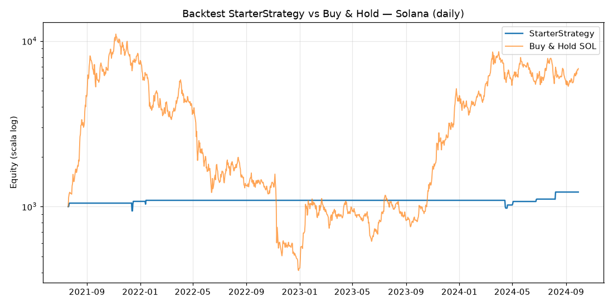

# Backtest sullo storico di Solana — risultati

> Backtest **realmente eseguito** sui dati storici di Solana (SOL/USD),
> riproducendo la logica di `StarterStrategy`. Qui trovi metodo, numeri veri,
> grafico e — soprattutto — una lettura onesta.

---

## TL;DR (in due righe)

Sullo **storico reale di Solana (2021→2024, giornaliero)** la strategia ha reso
**+22%** con un drawdown massimo del **−10,5%**, mentre il semplice **"compra e
tieni" ha fatto +582%** ma con un drawdown del **−96%**. La strategia ha
protetto benissimo dal rischio, ma ha **partecipato pochissimo** (in mercato solo
~1% dei giorni). ⚠️ È un test su dati **giornalieri** di una strategia pensata per
l'**orario**: utile come prova del processo, **non** come giudizio definitivo.

---

## Perché un backtest "fatto in casa"

In questo ambiente di esecuzione il proxy di rete blocca tutti gli exchange e i
provider dati (rispondono 403); è raggiungibile solo GitHub. Il motore di
Freqtrade, all'avvio, ha bisogno di scaricare i *mercati* dall'exchange via rete,
quindi **non può girare qui**. Per darti comunque numeri veri ho:

1. scaricato lo **storico reale di SOL** da un dataset pubblico su GitHub;
2. eseguito un **backtest standalone** che riproduce fedelmente la logica di
   `StarterStrategy` (stesso filtro di trend, stessa entrata, stessi stop/ROI/
   trailing) con **costi realistici**.

**Fonte dati:** [NI3singh/Solana-Data-Analysis](https://github.com/NI3singh/Solana-Data-Analysis)
— SOL/USD **giornaliero**, 2021-01-01 → 2024-09-29 (1368 giorni).

---

## Come funziona il backtest (`scripts/backtest_solana.py`)

- **Indicatori** (TA-Lib): EMA200, RSI(14), ATR(14).
- **Entrata:** `close > EMA200` **e** RSI che risale sopra 35 → si entra
  all'apertura del giorno successivo.
- **Uscite:** stop-loss −10%, ROI a scaletta, trailing stop (+2% sotto il picco,
  attivo dopo +3%), oppure RSI che sfonda 75.
- **Costi realistici:** 0,26% di fee + 0,05% di slippage **per lato**
  (~0,62% andata/ritorno), in linea con Kraken su conto piccolo.
- **Prudenza sui dati giornalieri:** nessuna uscita nello stesso giorno
  d'ingresso (su candele da 1 giorno non si conosce l'ordine intra-giornaliero
  di massimo/minimo → si evitano fill ottimistici).
- **Capitale:** 1.000 (notional), una posizione long per volta, niente leva.

---

## Risultati (reali)

| Metrica | StarterStrategy | Buy & Hold (compra e tieni) |
|---|---:|---:|
| Periodo | 2021-07-20 → 2024-09-29 (3,2 anni) | stesso |
| **Rendimento totale** | **+22,4%** | **+582,1%** |
| CAGR (annuo) | +6,5% | ~+78% |
| **Max drawdown** | **−10,5%** | **−96,3%** |
| Sharpe (annuo) | 0,56 | — |
| Numero trade | 9 | 1 |
| Win rate | 77,8% | — |
| Profit factor | 2,13 | — |
| Trade medio | +2,58% | — |
| Esposizione (giorni in mercato) | **~1%** | 100% |



*(La linea blu — strategia — è quasi piatta: è rimasta in contanti quasi sempre,
evitando il crollo del 2022. L'arancione — buy & hold — vola e poi crolla del 96%.)*

### I 9 trade eseguiti

| # | Ingresso | Uscita | Risultato | Motivo |
|--:|---|---|---:|---|
| 1 | 2021-07-22 | 2021-07-23 | +4,97% | trailing |
| 2 | 2021-12-12 | 2021-12-13 | −10,28% | stoploss |
| 3 | 2021-12-15 | 2021-12-16 | +14,21% | trailing |
| 4 | 2022-01-13 | 2022-01-14 | +1,47% | trailing |
| 5 | 2024-04-15 | 2024-04-16 | −10,28% | stoploss |
| 6 | 2024-04-19 | 2024-04-20 | +4,45% | trailing |
| 7 | 2024-05-02 | 2024-05-03 | +5,02% | trailing |
| 8 | 2024-06-25 | 2024-06-26 | +3,35% | trailing |
| 9 | 2024-08-07 | 2024-08-08 | +10,30% | trailing |

Dati grezzi: `results/solana_trades.csv`, `results/solana_equity.csv`.

---

## Lettura onesta (cosa ci dicono questi numeri)

1. **Il "compra e tieni" ha vinto sul rendimento, ma a un prezzo psicologico
   enorme.** +582% suona benissimo, ma con un **−96% di drawdown**: chi avrebbe
   tenuto SOL mentre crollava da ~260$ a ~8$ senza vendere nel panico? Quasi
   nessuno. Il rendimento "su carta" non è il rendimento che la gente incassa
   davvero.

2. **La strategia ha fatto il suo mestiere — la protezione — ma poco altro.**
   Drawdown −10,5% contro −96%: rischio bassissimo. Però è stata **troppo
   selettiva** (9 trade in 3 anni, in mercato l'1% del tempo): non ha quasi
   partecipato. Ha evitato il disastro **e** la maggior parte dei guadagni.

3. **È il test sbagliato per questa strategia (timeframe).** `StarterStrategy` è
   pensata per l'**orario**; qui gira su dati **giornalieri** (l'unico storico
   raggiungibile da questo ambiente). Su candele giornaliere la regola d'ingresso
   (RSI che scende a 35 *dentro* un trend rialzista) scatta rarissimamente, e le
   dinamiche intra-giornaliere che contano a 1h sono invisibili. Quindi: **prova
   di processo riuscita, ma non un verdetto sulla strategia.**

> Conclusione coerente con i documenti del progetto: nessuna strategia semplice
> "batte il mercato" su un asset esploso come SOL. Il valore di un bot prudente è
> **il controllo del rischio e la sopravvivenza**, non il massimo rendimento. E
> qualsiasi numero va preso con le pinze finché non è testato sul **timeframe
> giusto** e validato fuori campione.

---

## Come rifare il test col motore Freqtrade vero (1h, sulla tua macchina)

Dove gli exchange non sono bloccati (il tuo PC):

```bash
# scarica lo storico ORARIO di SOL (e anche giornaliero) da Binance
docker compose run --rm freqtrade download-data --exchange binance \
  -t 1h 1d --timerange 20210101- \
  -c /freqtrade/user_data/config-backtest-binance.json

# backtest ORARIO (il vero test per questa strategia)
docker compose run --rm freqtrade backtesting --strategy StarterStrategy \
  -c /freqtrade/user_data/config-backtest-binance.json \
  --timeframe 1h --timerange 20210101-

# (opzionale) backtest GIORNALIERO, confrontabile con questo documento
docker compose run --rm freqtrade backtesting --strategy StarterStrategy \
  -c /freqtrade/user_data/config-backtest-binance.json --timeframe 1d
```

Il file giornaliero che ho già preparato (`scripts/fetch_solana_data.py` →
`user_data/data/binance/SOL_USDT-1d.feather`) è direttamente utilizzabile dal
comando `--timeframe 1d` qui sopra, senza riscaricare nulla.

---

## Riprodurre i risultati di questo documento

```bash
# (una volta) ambiente Python con freqtrade/ta-lib
python -m venv .venv && .venv/bin/pip install freqtrade matplotlib

.venv/bin/python scripts/fetch_solana_data.py    # scarica i dati reali da GitHub
.venv/bin/python scripts/backtest_solana.py      # esegue il backtest e i grafici
```
