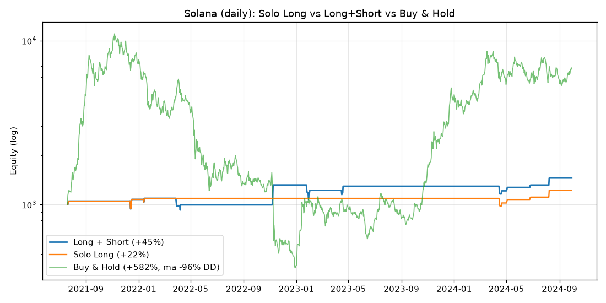

# Buy **e** Sell (long + short) e come avere lo storico a 1h

Questo documento risponde a due richieste:
1. far operare il bot **sia in acquisto (buy/long) sia in vendita (sell/short)**;
2. come **collegare un exchange** per avere lo storico a **1 ora**.

---

# Parte A — Comprare E vendere allo scoperto (long + short)

## Cosa significa davvero "vendere"

- Sullo **spot** (la config attuale, Kraken spot) puoi solo andare **long**:
  compri e poi vendi ciò che possiedi. "Vendere" = chiudere un acquisto. **Non**
  puoi guadagnare quando il prezzo *scende*.
- Per guadagnare anche dai ribassi serve la **vendita allo scoperto (short)**,
  possibile solo con i **futures** (margine). 

> 🔴 **Avviso rischio.** I futures usano **leva** e comportano il rischio di
> **liquidazione**: puoi perdere tutto (e più in fretta) rispetto allo spot. Lo
> short è uno strumento da esperti. Per questo l'ho impostato in modo prudente:
> **dry-run** di default e **leva 1x** (nessuna amplificazione). Resta comunque
> più rischioso dello spot long-only. La configurazione sicura per principianti
> rimane quella spot (`StarterStrategy`).

## Cosa ho creato

- **`user_data/strategies/StarterStrategyLS.py`** — versione long **+** short:
  - **Long:** trend rialzista (`close > EMA200`) + RSI che risale da 35.
  - **Short:** trend ribassista (`close < EMA200`) + RSI che scende da 65.
  - `can_short = True`, leva 1x (callback `leverage()`), stesse protezioni.
- **`user_data/config-futures.json`** — config **futures** (margine isolato),
  in **dry-run**, leva gestita dalla strategia. Default su **Binance Futures**
  (storico migliore); per restare in casa Kraken usa `"name": "krakenfutures"`
  e coppie tipo `SOL/USD:USD`.

## Risultato reale sul backtest di Solana (daily)

Stesso metodo del [backtest precedente](backtest-solana.md), ma con gli short
attivi:

| | Solo Long | **Long + Short** | Buy & Hold |
|---|---:|---:|---:|
| Rendimento totale | +22,4% | **+45,2%** | +582% |
| CAGR | +6,5% | **+12,4%** | ~+78% |
| Max drawdown | −10,5% | **−18,4%** | **−96%** |
| Trade | 9 | **16** (9 long / 7 short) | 1 |
| Win rate | 77,8% | 68,8% | — |
| In mercato | ~1% | ~2% | 100% |



**Lettura onesta:** aggiungere gli short ha **raddoppiato** il rendimento
(+22% → +45%), soprattutto grazie a uno short che ha intercettato il **crollo
FTX di novembre 2022 (+32% in un trade)**. Ma ha anche **aumentato il
drawdown** (−10,5% → −18,4%): più rendimento *e* più rischio. Resta comunque
molto selettivo (in mercato ~2% dei giorni) e lontanissimo dal "compra e tieni"
sul rendimento — ma con un rischio enormemente inferiore (−18% contro −96%).

## Come usarlo (in dry-run, sul tuo PC)

```bash
docker compose run --rm freqtrade trade \
  --strategy StarterStrategyLS \
  -c /freqtrade/user_data/config-futures.json
```

> Per andare live servono un **conto futures** (Binance Futures / Kraken Futures)
> e chiavi API dedicate (solo trading, no prelievo). **Non farlo** finché non hai
> validato a lungo in dry-run e capito la liquidazione. Con 50€ e leva, lo short
> è il modo più rapido per azzerare il conto: vai pianissimo.

---

# Parte B — Come avere lo storico a 1 ora

## Il vincolo (importante)

L'ambiente cloud in cui giro io raggiunge **solo PyPI e GitHub**: **tutti gli
exchange e i provider dati sono bloccati** (Binance, Kraken, Coinbase,
`data.binance.vision`… rispondono 403). Quindi **non posso collegarmi a un
exchange da qui, nemmeno con le tue chiavi API**. Non è un problema di chiavi: è
la rete dell'ambiente. Ecco le tre soluzioni reali.

## Opzione 1 — Il "ponte GitHub" (consigliata: così posso fare io il backtest 1h)

Tu scarichi i dati sul **tuo** PC (dove gli exchange funzionano) e li pubblichi
su GitHub; io li leggo da lì.

```bash
# sul TUO computer
pip install ccxt pandas
python scripts/download_1h_data.py            # SOL, BTC, ETH a 1h dal 2021
# salva user_data/data_sources/SOL_USDT-1h.csv (e BTC/ETH)

git add user_data/data_sources/*-1h.csv
git commit -m "Aggiungi storico 1h"
git push
```

Poi scrivimi "ho pushato i dati 1h" e **eseguo io il backtest orario** su quei
dati (stesso motore dei backtest già fatti). Non servono chiavi API: i dati
OHLCV pubblici si scaricano senza login.

## Opzione 2 — Fai girare il backtest direttamente tu (con Freqtrade)

Sul tuo PC, dove Freqtrade raggiunge l'exchange:

```bash
docker compose run --rm freqtrade download-data --exchange binance \
  -t 1h --timerange 20210101- \
  -c /freqtrade/user_data/config-backtest-binance.json

docker compose run --rm freqtrade backtesting --strategy StarterStrategy \
  -c /freqtrade/user_data/config-backtest-binance.json \
  --timeframe 1h --timerange 20210101-
```

## Opzione 3 — Collegare l'exchange per il LIVE (sul tuo PC)

Questo serve quando vuoi far operare il bot per davvero, e si fa **sulla tua
macchina**, non qui. In breve (dettagli in [setup-freqtrade.md](setup-freqtrade.md)):

1. Crea una chiave API sull'exchange con permesso **solo Trading** (mai
   prelievo), con **IP whitelist**.
2. Mettila nel file `.env` (vedi `.env.example`) o in `config-private.json`.
3. Avvia con `docker compose up -d`. Il bot si collega da solo all'exchange.

> Riassunto: **io** posso lavorare sui dati solo tramite GitHub (Opzione 1);
> **l'exchange si collega al bot sul tuo computer** (Opzioni 2 e 3), non a me.
