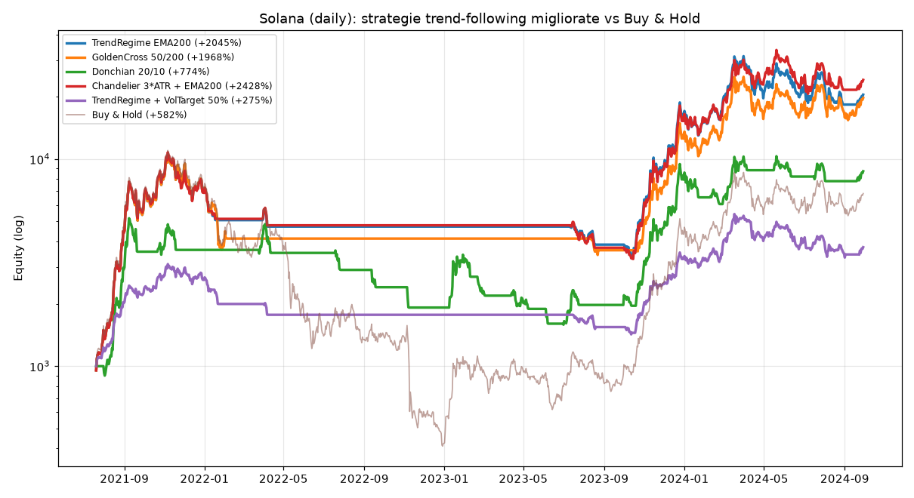

# Miglioramento delle performance — dallo "scalping cauto" al trend-following

> Come e perché ho cercato performance più alte, **con i numeri reali su Solana
> e i caveat onesti**. Leggi anche i caveat: i numeri da soli ingannano.

---

## Il problema della strategia attuale

La `StarterStrategy` (vedi `docs/backtest-solana.md`) è **troppo cauta**: entra
solo su rari ribassi e chiude dopo poche ore. Risultato sul backtest di Solana:
**+22%** in 3 anni, in mercato solo **~1% dei giorni**. Praticamente non
partecipa ai trend. Su un asset esploso come SOL, questo è il difetto numero uno.

## L'idea per migliorare (Leva 5 di `potenziamento-v2.md`)

Passare al **TREND-FOLLOWING**: entrare quando il trend è rialzista e **restare
dentro** finché regge, *lasciando correre i profitti*, invece di scalpare. Si
esce quando il trend si rompe. Per non fare overfitting ho usato parametri
**classici** (EMA 50/200, Donchian 20/10, chandelier 3·ATR), non tarati su SOL.

## Risultati reali (Solana, daily, 2021-2024, solo long, niente leva)

| Strategia | Rend. totale | CAGR | Max DD | Sharpe | Calmar | Trade | Espos. |
|---|---:|---:|---:|---:|---:|---:|---:|
| StarterStrategy (attuale) | +22% | +6% | **−10%** | 0,56 | — | 9 | 1% |
| **TrendRegime EMA200** | **+2045%** | +161% | −68% | 1,69 | 2,38 | 12 | 48% |
| **GoldenCross 50/200** | **+1968%** | +158% | −67% | 1,66 | 2,35 | 3 | 48% |
| Donchian 20/10 | +774% | +97% | −69% | 1,32 | 1,40 | 18 | 36% |
| **Chandelier 3·ATR+EMA200** | **+2428%** | +175% | −69% | **1,78** | **2,52** | 25 | 46% |
| TrendRegime + VolTarget 50% | +275% | +51% | −54% | 1,28 | 0,95 | 8 | 47% |
| Buy & Hold (riferimento) | +582% | +82% | **−96%** | 1,10 | 0,86 | 1 | 100% |



**In breve:** il trend-following ha reso **3-4× il "compra e tieni"** (+2000% vs
+582%) e **~100× la strategia attuale** (+22%), con un drawdown **molto più
basso del buy & hold** (−68% vs −96%) — perché è uscito prima del crollo 2022.

## ⚠️ I caveat (leggili: senza, i numeri sopra sono pericolosi)

1. **Rischio di overfitting enorme.** È UN solo asset, UN periodo, dati
   giornalieri. SOL è stato uno degli asset più "in trend" della storia: il
   trend-following lì brilla per forza. La scansione di robustezza lo mostra:
   `TrendRegime` con EMA250 rende **+120%** invece di +2045% → **forte
   sensibilità ai parametri**. Non fidarti di un singolo numero.
2. **Il drawdown resta brutale: ~−68%.** Con 50€ significa vederli scendere a
   **~16€** prima di risalire. Quasi nessuno regge psicologicamente: si vende
   nel panico al punto peggiore. "Rendimento su carta" ≠ rendimento incassato.
3. **Il trend-following soffre nei mercati laterali** (whipsaw: entra ed esce in
   perdita di continuo). Funziona quando c'è un trend forte; in un mercato
   "piatto" perde. SOL ha avuto trend enormi — non è garantito altrove.
4. **Il vol-targeting qui NON ha aiutato** (Calmar 0,95 vs 2,38): ridurre
   l'esposizione in alta volatilità ha tagliato proprio i guadagni migliori di
   SOL. Su altri asset potrebbe invece aiutare. Altra prova che i risultati sono
   specifici di SOL.

> **Conclusione onesta (coerente con `mentalita-esperti.md`):** il
> trend-following è un miglioramento **vero e strutturale** (partecipa ai trend,
> taglia le perdite, batte sia la strategia cauta sia il buy & hold su questo
> asset). Ma il **+2428% non è una promessa**: è ciò che sarebbe successo su SOL
> col senno di poi. Va validato fuori campione e su più asset, e il drawdown va
> accettato o ridotto con size piccola e diversificazione.

## Cosa ho creato

- **`user_data/strategies/TrendFollowStrategy.py`** — strategia trend-following:
  entra in trend rialzista confermato (EMA50>EMA200 & close>EMA50 & ADX>20),
  **take-profit disattivato** (lascia correre), esce quando `close < EMA200`, con
  trailing ampio (15%). Solo long, niente leva.
- **`scripts/backtest_solana_improved.py`** — il confronto qui sopra, con la
  scansione di robustezza e il grafico.

## I prossimi passi corretti (per non illudersi)

1. **Validare su BTC ed ETH** (non solo SOL): se regge su più asset, è più
   credibile. Si fa col "ponte 1h" (`scripts/download_1h_data.py`).
2. **Validare a 1h e fuori campione** (walk-forward), non solo daily 2021-2024.
3. **Diversificare** su più asset per abbassare il drawdown (Leva 2/5).
4. Solo dopo, dry-run lungo e infine size piccola.

## Come provarla (dry-run, sul tuo PC)

```bash
docker compose run --rm freqtrade trade --strategy TrendFollowStrategy \
  -c /freqtrade/user_data/config.json   # spot, dry-run

# backtest a 1h quando hai i dati (vedi docs/buy-and-sell-e-dati-1h.md)
docker compose run --rm freqtrade backtesting --strategy TrendFollowStrategy \
  -c /freqtrade/user_data/config-backtest-binance.json --timeframe 1h --timerange 20210101-
```
