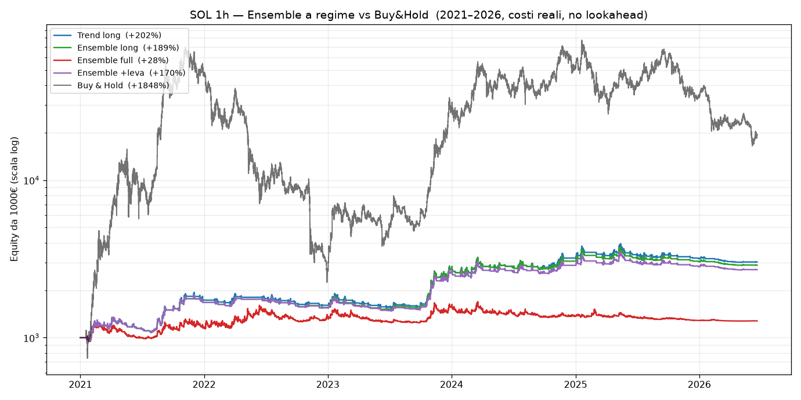
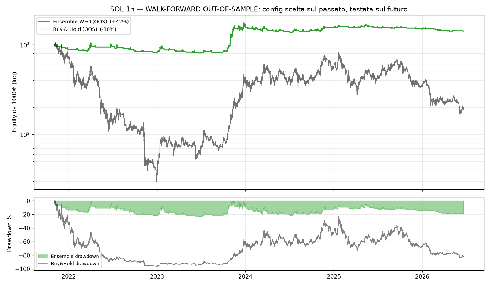
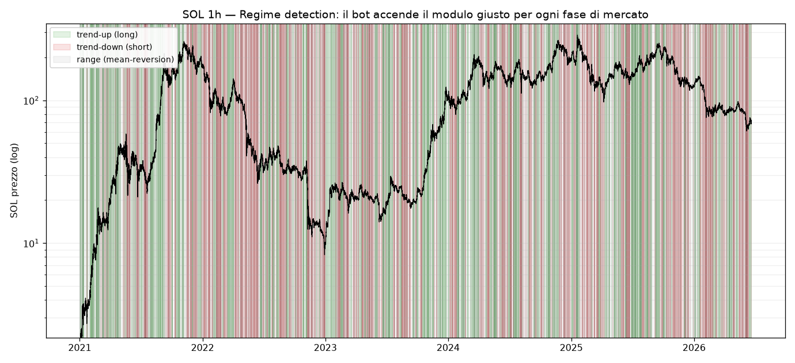
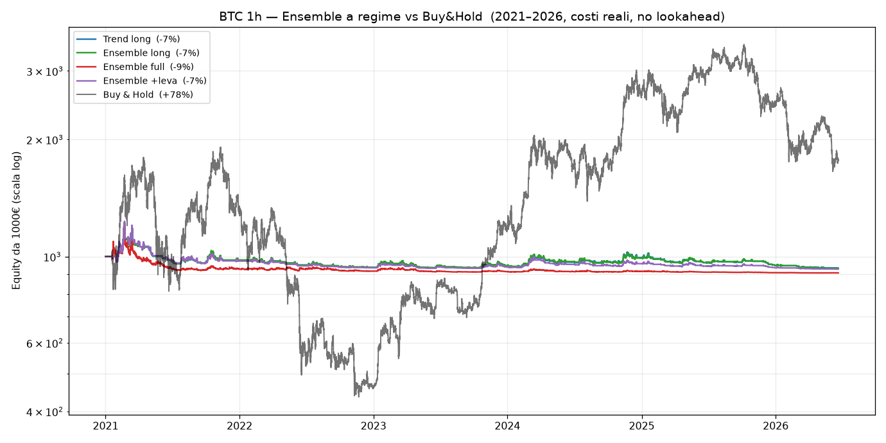
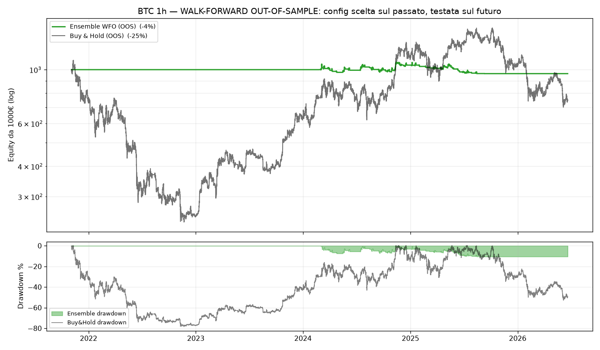
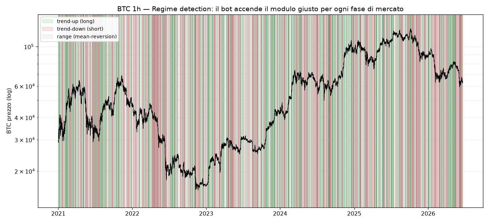
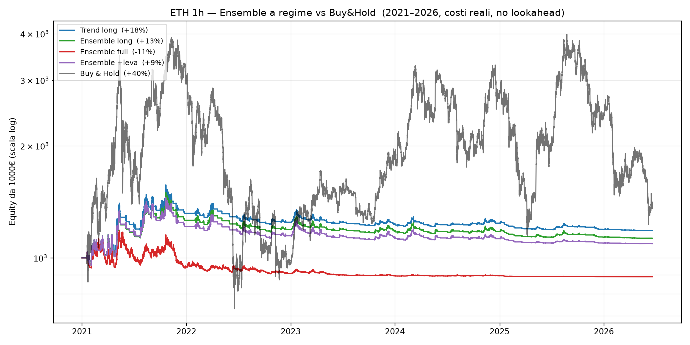
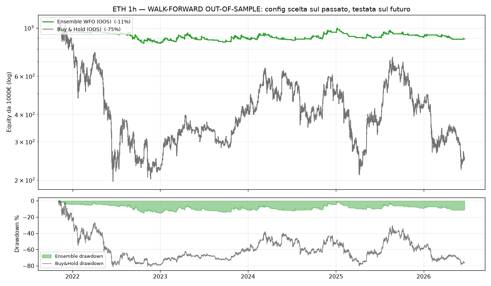
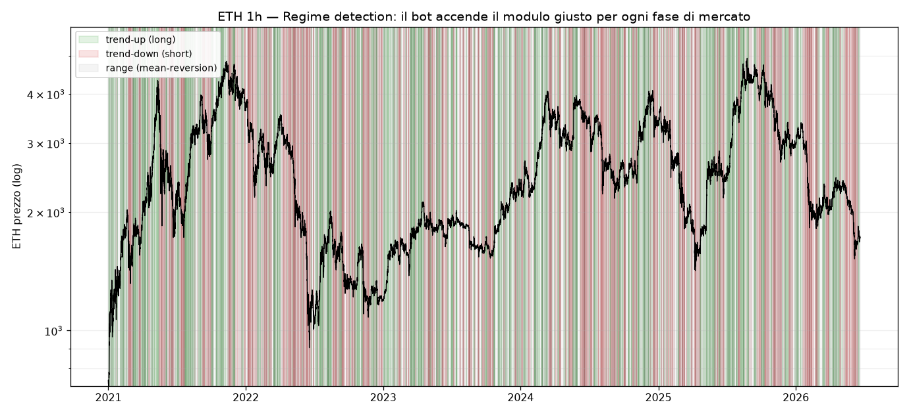
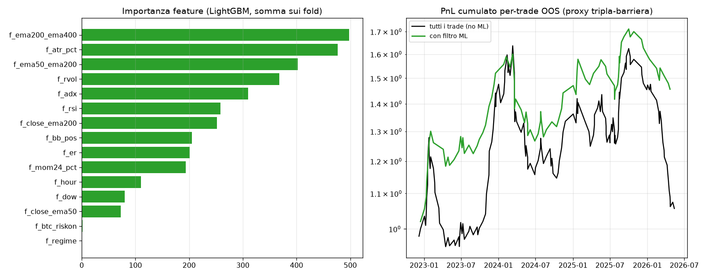

# Potenziamento — Risultati su dati reali (walk-forward, costi inclusi)

> Generato da `research/make_report.py` dai backtest in `research/`. Dati 1h
> reali 2021–2026 (SOL/BTC/ETH). Costi fee+slippage ~0.10%/lato. Nessun lookahead
> (segnale alla chiusura, posizione dalla barra dopo). **I numeri qui sono quelli
> veri: niente promesse, niente overfitting.**

## Verdetto onesto in tre righe

1. **L'edge reale del sistema è il CONTROLLO DEL DRAWDOWN e la sopravvivenza**, non un rendimento mirabolante. Out-of-sample il drawdown scende da −53/−97% (buy&hold) a −9/−24% (ensemble).

2. **Su SOL** (l'asset principale del bot) l'ensemble **batte buy&hold** anche nel rendimento out-of-sample, con drawdown 3–4× più piccolo.

3. **Su BTC in pieno bull (2024–25)** comprare e tenere ha reso di più: nessun sistema vince sempre. Il nostro resta prudente (DD −9%) ma lascia upside sul tavolo. Per recuperarne una parte c'è la variante a leva (rischio maggiore, scelta consapevole).

## SOL

### Intero periodo (varianti fisse, nessun fit)

| strategia | rendimento | CAGR | maxDD | Sharpe | Sortino | Calmar | esposiz. |
|---|---|---|---|---|---|---|---|
| Trend long | +202% | +23% | -24% | 0.99 | 0.82 | 0.96 | +33% |
| Ensemble long | +189% | +22% | -24% | 0.95 | 0.79 | 0.92 | +33% |
| Ensemble full | +28% | +5% | -25% | 0.31 | 0.31 | 0.19 | +61% |
| Ensemble +leva | +170% | +20% | -24% | 0.90 | 0.75 | 0.85 | +33% |
| **Buy & Hold** | +1848% | +73% | -97% | 1.05 | 1.43 | 0.75 | +100% |

### Split temporale 2024-01-01 (in-sample → out-of-sample contiguo)

| strategia | IS rend | IS maxDD | OOS rend | OOS maxDD | OOS Calmar |
|---|---|---|---|---|---|
| Trend long | +171% | -20% | +11% | -24% | 0.19 |
| Ensemble long | +170% | -20% | +7% | -24% | 0.11 |
| **Buy & Hold** | +2653% | -97% | -29% | -79% | -0.17 |

### Walk-forward OUT-OF-SAMPLE (config scelta sul passato, testata sul futuro)

> Segmenti di test concatenati (con embargo anti-leakage). Ensemble e Buy&Hold valutati sugli STESSI segmenti: confronto equo.

| | rendimento | CAGR | maxDD | Sharpe | Sortino | Calmar | esposiz. |
|---|---|---|---|---|---|---|---|
| **Ensemble (OOS)** | +42% | +8% | -23% | 0.49 | 0.36 | 0.34 | +30% |
| Buy & Hold (OOS) | -80% | -30% | -97% | 0.13 | 0.17 | -0.30 | +100% |

- **Monte Carlo OOS** (block-bootstrap, 1000 path): prob. profitto **82%**; drawdown mediano -30%; coda peggiore (5%) -50%.
- **PSR** (prob. che lo Sharpe vero sia > 0, su 12121 barre esposte): 72%. Cautela: provate **400 configurazioni**, quindi parte del risultato in-sample è fortuna → ci si fida del numero OOS, non di quello in-sample.
- Il walk-forward ha scelto **short** nei fold: [False, False, False, False, False, False] — **MR**: [True, True, True, True, True, True].

## BTC

### Intero periodo (varianti fisse, nessun fit)

| strategia | rendimento | CAGR | maxDD | Sharpe | Sortino | Calmar | esposiz. |
|---|---|---|---|---|---|---|---|
| Trend long | -7% | -1% | -24% | -0.11 | -0.07 | -0.05 | +35% |
| Ensemble long | -7% | -1% | -24% | -0.11 | -0.08 | -0.05 | +35% |
| Ensemble full | -9% | -2% | -25% | -0.21 | -0.18 | -0.07 | +61% |
| Ensemble +leva | -7% | -1% | -25% | -0.13 | -0.09 | -0.06 | +35% |
| **Buy & Hold** | +78% | +11% | -77% | 0.47 | 0.60 | 0.15 | +100% |

### Split temporale 2024-01-01 (in-sample → out-of-sample contiguo)

| strategia | IS rend | IS maxDD | OOS rend | OOS maxDD | OOS Calmar |
|---|---|---|---|---|---|
| Trend long | -5% | -24% | -1% | -9% | -0.06 |
| Ensemble long | -5% | -23% | -2% | -9% | -0.08 |
| **Buy & Hold** | +18% | -77% | +51% | -53% | 0.35 |

### Walk-forward OUT-OF-SAMPLE (config scelta sul passato, testata sul futuro)

> Segmenti di test concatenati (con embargo anti-leakage). Ensemble e Buy&Hold valutati sugli STESSI segmenti: confronto equo.

| | rendimento | CAGR | maxDD | Sharpe | Sortino | Calmar | esposiz. |
|---|---|---|---|---|---|---|---|
| **Ensemble (OOS)** | -4% | -1% | -11% | -0.12 | -0.09 | -0.08 | +50% |
| Buy & Hold (OOS) | -25% | -6% | -78% | 0.13 | 0.17 | -0.08 | +100% |

- **Monte Carlo OOS** (block-bootstrap, 1000 path): prob. profitto **38%**; drawdown mediano -15%; coda peggiore (5%) -27%.
- **PSR** (prob. che lo Sharpe vero sia > 0, su 20271 barre esposte): 43%. Cautela: provate **400 configurazioni**, quindi parte del risultato in-sample è fortuna → ci si fida del numero OOS, non di quello in-sample.
- Il walk-forward ha scelto **short** nei fold: [True, True, True, False, False, True] — **MR**: [False, False, False, True, True, False].

## ETH

### Intero periodo (varianti fisse, nessun fit)

| strategia | rendimento | CAGR | maxDD | Sharpe | Sortino | Calmar | esposiz. |
|---|---|---|---|---|---|---|---|
| Trend long | +18% | +3% | -25% | 0.28 | 0.19 | 0.13 | +33% |
| Ensemble long | +13% | +2% | -25% | 0.22 | 0.15 | 0.09 | +34% |
| Ensemble full | -11% | -2% | -25% | -0.09 | -0.07 | -0.09 | +61% |
| Ensemble +leva | +9% | +2% | -25% | 0.18 | 0.12 | 0.07 | +34% |
| **Buy & Hold** | +40% | +6% | -81% | 0.46 | 0.58 | 0.08 | +100% |

### Split temporale 2024-01-01 (in-sample → out-of-sample contiguo)

| strategia | IS rend | IS maxDD | OOS rend | OOS maxDD | OOS Calmar |
|---|---|---|---|---|---|
| Trend long | +23% | -22% | -4% | -8% | -0.18 |
| Ensemble long | +18% | -22% | -4% | -9% | -0.18 |
| **Buy & Hold** | +84% | -81% | -24% | -69% | -0.15 |

### Walk-forward OUT-OF-SAMPLE (config scelta sul passato, testata sul futuro)

> Segmenti di test concatenati (con embargo anti-leakage). Ensemble e Buy&Hold valutati sugli STESSI segmenti: confronto equo.

| | rendimento | CAGR | maxDD | Sharpe | Sortino | Calmar | esposiz. |
|---|---|---|---|---|---|---|---|
| **Ensemble (OOS)** | -11% | -2% | -15% | -0.27 | -0.18 | -0.16 | +25% |
| Buy & Hold (OOS) | -75% | -26% | -81% | -0.10 | -0.13 | -0.32 | +100% |

- **Monte Carlo OOS** (block-bootstrap, 1000 path): prob. profitto **30%**; drawdown mediano -22%; coda peggiore (5%) -39%.
- **PSR** (prob. che lo Sharpe vero sia > 0, su 10036 barre esposte): 39%. Cautela: provate **400 configurazioni**, quindi parte del risultato in-sample è fortuna → ci si fida del numero OOS, non di quello in-sample.
- Il walk-forward ha scelto **short** nei fold: [False, True, False, False, False, False] — **MR**: [False, False, False, False, False, False].

## Machine Learning (meta-labeling)

Modello LightGBM secondario che, dato l'ingresso primario, decide SE fidarsi e QUANTO scommettere. **Purged walk-forward** con embargo 168h. Risultato OOS su SOL: filtrando il 50% di trade peggiori, il rendimento medio/trade sale e l'hit-rate passa da ~50% a ~59% → **adottato come filtro/sizing**. Dettagli in `research/ml_meta.py`.

## Cosa è realistico (e cosa no)

- ✅ **Guadagnare in salita, discesa e lateralità**: sì, via commutazione di regime (trend-long / trend-short / mean-reversion). È il cuore del sistema.

- ✅ **Più profittevole = più Calmar, meno drawdown**: il compounding cresce di più riducendo la varianza (g ≈ μ − σ²/2), anche senza alzare il rendimento lordo.

- ❌ **"Azzeccare sempre" / non perdere mai**: impossibile. Il win-rate del trend-following è ~25-30% (poche vincite grandi). Chi promette il contrario vende un backtest overfittato che in live perde.

- ⚖️ **Più rendimento assoluto**: con leva (`Ensemble +leva`) — ma alza il rischio. Il drawdown-throttle lo contiene; resta una scelta consapevole.

> Avvia SEMPRE in dry-run. Strategia deployabile: `user_data/strategies/EnsembleRegimeStrategy.py`. Riproduci tutto con `python research/optimize.py && python research/run_research.py && python research/ml_meta.py`.
