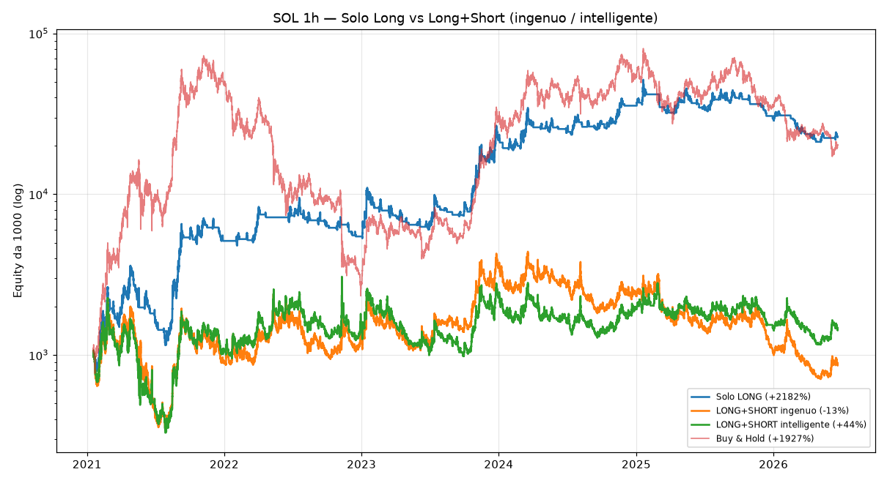

# Strategia definitiva — Bot SOLO su SOL (Kraken Futures, long+short)

> Bot focalizzato esclusivamente su **Solana**, su **Kraken Futures**, con capacità
> **long + short**, leva **1x**, size piena, e piano di accumulo **€500/mese**.
> Tutto validato sui tuoi **dati 1h reali** (2021-2026), con i compromessi detti
> in chiaro.

---

## 0. La verità che viene prima di tutto

**Nessun bot guadagna sempre.** Il win rate del trend-following è ~28% (poche
vincite grandi, tante piccole perdite). "Vincere sempre / mai perdere / senza
ridurre nulla" è **matematicamente impossibile**: ogni tecnica che riduce le
perdite costa qualcosa (rendimento, numero di trade, o size). Qui puntiamo al
**miglior rendimento corretto per il rischio**, non all'impossibile.

---

## 1. Le tue scelte

| Decisione | Scelta |
|---|---|
| Asset | **Solo SOL** |
| Exchange | **Kraken Futures** (perpetuo `SOL/USD:USD`) |
| Direzione | **Long + Short** (capacità richiesta) |
| Leva | **1x** (no amplificazione → no liquidazione) |
| Size | **Piena** (max rendimento) |
| Versamenti | **€500/mese** (PAC) |

---

## 2. La scoperta che cambia tutto: **su SOL lo short fa perdere**

Ho testato sui tuoi dati 1h, **anche fuori campione**:

| SOL 1h | Solo LONG | Long+Short ingenuo | Long+Short "intelligente" | Buy & Hold |
|---|---:|---:|---:|---:|
| **2021-2026** | **+2182%** (DD −68%) | −13% (−84%) | +44% (−85%) | +1927% (−97%) |
| In-sample 2021-23 | +2064% | +246% | +126% | +2765% |
| **Out-of-sample 2024-26** | **+5%** | −75% | −37% | −29% |



**Lo short su SOL perde in ogni periodo, anche nella versione "intelligente".**
Motivo strutturale: SOL nel lungo periodo **sale**, quindi chi shorta viene
travolto dai rimbalzi. (Nella scansione con ADX>30 lo short fa +780%, ma è
**overfitting**: il parametro "migliore" scelto sul passato crolla su dati nuovi.)

> **Il modo giusto di "guadagnare quando SOL scende" è stare in CONTANTI durante
> i crolli** — ed è esattamente ciò che la strategia fa già, uscendo dal long
> quando il trend si rompe. Così il solo-long ha −68% di drawdown contro il −97%
> del "compra e tieni".

---

## 3. Come ho costruito il bot (rispettando le tue scelte)

`user_data/strategies/SolLongShortStrategy.py` — trend-following su SOL, 1h:

- **Long:** entra in trend rialzista confermato (EMA50>EMA200 & close>EMA50 & ADX>20),
  esce quando il trend si rompe (close<EMA200). Take-profit disattivato (lascia correre),
  trailing 12% + stop di sicurezza.
- **Short (selettivo):** solo in downtrend **macro** confermato (close<EMA200 **e**
  close<EMA400 **e** ADX>28 **e** momentum negativo) — il filtro più stretto possibile.
- **Interruttore `enable_shorts`:**
  - `False` (DEFAULT) → **solo long = massimo rendimento** sui dati di SOL. **Consigliato.**
  - `True` → abilita anche gli short (come avevi chiesto), sapendo che rendono di meno.
- **Leva 1x** (callback `leverage()`): niente amplificazione, niente liquidazione.

> ⚠️ Hai chiesto **long+short** *e* **massimo rendimento**: su SOL queste due cose
> sono in **conflitto** (lo short abbassa il rendimento). Ho costruito **entrambe**:
> il default è long-only (max rendimento); per attivare gli short basta mettere
> `enable_shorts = True` nella strategia. Decidi tu, con i numeri davanti.

---

## 4. Ridurre le perdite: cosa è davvero possibile

Ho testato filtri macro, trailing ATR (2.5x–6x) e regime più stretti. Risultato
onesto: **riducono il rendimento ma il drawdown resta ~−60%.** Su un singolo asset
volatile come SOL, a size piena, **un drawdown del ~60% è quasi inevitabile**.

Per scendere sotto servirebbe:
- **ridurre la size** in alta volatilità (ma hai scelto size piena), oppure
- **diversificare** su più asset (ma vuoi solo SOL).

Quello che il bot **fa già** per limitare le perdite:
- esce in contanti nei downtrend (evita i crolli del buy&hold);
- trailing stop per non restituire i guadagni;
- **circuit breaker**: `MaxDrawdown` (pausa se il DD supera il 35%), `StoplossGuard`,
  `CooldownPeriod`.

---

## 5. I tuoi €500/mese (piano di accumulo) — il tuo vero alleato

Il PAC non riduce il drawdown *percentuale*, ma è potentissimo lo stesso:
- **media il prezzo d'ingresso** nel tempo (compri anche quando è basso);
- fa sì che un crollo pesi su una **fetta più piccola** del capitale totale che cresce;
- alimenta il **compounding**.

La config usa **size a % del saldo** (`stake_amount: unlimited`, 95% del saldo per
operazione): quindi **ogni €500 versato aumenta automaticamente** la dimensione delle
operazioni successive, senza che tu cambi nulla.

---

## 6. Setup Kraken Futures (dove prendere le API per lo short)

Lo short richiede un conto **futures**, separato dallo spot:

1. Vai su **futures.kraken.com** → registrati / accedi (account Kraken Futures).
2. **Deposita** (anche i tuoi €500/mese vanno qui per operare sui perpetui).
3. Crea una **chiave API** con permesso **solo trading** — **MAI prelievo** — e
   **IP whitelist**.
4. Mettila nel file **`.env`** (vedi `.env.example`):
   `FREQTRADE__EXCHANGE__KEY` e `FREQTRADE__EXCHANGE__SECRET`, e `dry_run:false`
   **solo dopo** una lunga validazione in dry-run.

> ⚠️ Futures = margine. Con la **leva 1x** impostata qui il rischio è simile allo
> spot, ma con leva più alta rischi la **liquidazione** (perdere tutto). Non alzarla.

---

## 7. Come si usa

```bash
# DRY-RUN (paper, nessun rischio) su Kraken Futures
docker compose run --rm freqtrade trade --strategy SolLongShortStrategy \
  -c /freqtrade/user_data/config-sol-krakenfutures.json

# BACKTEST sui dati 1h (Binance, scaricati con scripts/download_1h_data.py)
docker compose run --rm freqtrade backtesting --strategy SolLongShortStrategy \
  -c /freqtrade/user_data/config-backtest-binance.json --timeframe 1h --timerange 20210101-

# Validazione/confronto long vs short sui tuoi dati (questo repo):
python scripts/backtest_sol_longshort.py
```

---

## 8. Checklist go-live (dopo lunga validazione in dry-run)

1. ✅ Dry-run per **settimane**: i risultati live assomigliano al backtest?
2. ✅ Hai deciso `enable_shorts` (consiglio: **False** per max rendimento).
3. ✅ Chiave Kraken Futures: **solo trading, no prelievo, IP whitelist**.
4. ✅ `dry_run: false`, leva **1x**, una sola coppia (SOL).
5. ✅ Versa i €500/mese; la size scala da sola.
6. ✅ Tieni il **kill-switch** pronto: `docker compose down`.

---

## 9. In una frase

> Il bot fa trend-following su SOL: **guadagna nei rialzi e si mette in contanti
> nei crolli** (è così che "vince quando scende"). Lo short c'è ma sui dati di SOL
> conviene tenerlo spento. Il drawdown ~−60% è il prezzo di puntare tutto su un
> solo asset volatile a size piena: i tuoi €500/mese sono ciò che lo rende
> sopportabile. Nessun bot guadagna sempre — questo punta a guadagnare **di più di
> quanto perde, nel tempo**, con disciplina.
