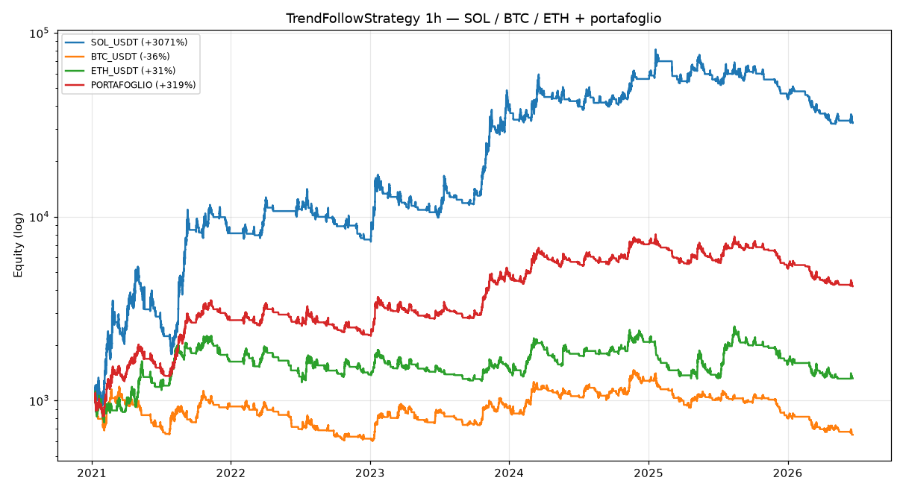

# Validazione 1h multi-asset — la prova del nove (e la verità scomoda)

> Test della `TrendFollowStrategy` sui **dati orari reali** di **SOL, BTC ed ETH**
> (2021→2026), scaricati da Binance. È la validazione "fuori campione" che
> separa un edge vero dalla fortuna. **Spoiler: era soprattutto fortuna di Solana.**

---

## Cosa abbiamo testato

Stessa strategia trend-following, stessa logica, ma su **3 asset** e a **1 ora**
(non più solo SOL daily). Dati: 47.906 candele orarie per asset, 2021-01 → 2026-06.
Solo long, niente leva, costi 0,15%/lato.

## Risultati

| Asset (1h) | TrendFollow | Buy & Hold | Verdetto |
|---|---:|---:|---|
| **SOL** | **+3071%** (DD −67%) | +2164% (DD −97%) | ✅ batte il B&H |
| **BTC** | **−36%** (DD −55%) | +59% (DD −77%) | ❌ **perde soldi** |
| **ETH** | +31% (DD −48%) | +44% (DD −81%) | ⚠️ peggio del B&H |
| **Portafoglio equipesato** | +319% (DD −48%) | — | media più onesta |



## La verità scomoda

**La strategia NON è robusta.** Funziona benissimo su SOL e male su BTC/ETH. Il
+2400% del backtest precedente era in gran parte **"fortuna di Solana"**, non un
vantaggio generalizzabile. Questo è esattamente l'avvertimento dei documenti
(`mentalita-esperti.md`, principi 1-2-7): *un edge deve reggere su più asset e
più periodi, altrimenti è overfitting.* Qui non regge.

**Perché fallisce su BTC/ETH:** il trend-following vive dei trend forti e
prolungati (che SOL ha avuto in abbondanza). BTC ed ETH, nel periodo, sono stati
più "laterali/choppy": la strategia ha fatto **~290 trade** facendosi
"sballottare" (whipsaw), entrando e uscendo in perdita e bruciando costi. Tanti
trade ≠ tanti soldi: spesso il contrario.

## Cosa ci insegna (ed è la cosa più preziosa di tutta la sessione)

1. **Non inseguire il numero più alto di un singolo backtest.** Il +3071% su SOL
   è seducente ma ingannevole: su un altro asset la stessa identica strategia
   perde. Chi avesse "ottimizzato per SOL" e poi messo soldi su BTC avrebbe perso.
2. **La validazione multi-asset/multi-periodo è ciò che smaschera l'illusione.**
   È noiosa e fa scendere i numeri, ma è l'unica difesa dall'auto-inganno.
3. **La diversificazione aiuta, ma non fa miracoli.** Il portafoglio dei 3 asset
   (+319%, DD −48%) è molto più credibile del sogno SOL-only, ma è anche molto
   più modesto — e resta da validare fuori campione.

## E adesso? (miglioramenti VERI, non fishing)

Migliorare davvero NON significa cercare i parametri che fanno sembrare belli
tutti e 3 gli asset (sarebbe overfitting al contrario, sul set di test). Significa:

1. **Diversificare** su un paniere di asset (riduce la dipendenza da SOL) —
   già visibile col portafoglio.
2. **Ridurre il whipsaw**: filtri di trend più "lenti"/forti (meno trade) per
   non farsi sballottare nei mercati laterali; o un filtro di regime che spegne
   il trend-following quando non c'è trend.
3. **Combinare strategie decorrelate** (trend + mean-reversion per regime), come
   da `potenziamento-v2.md` (Leva 5: ensemble).
4. **Accettare rendimenti modesti ma robusti**, validati out-of-sample, invece di
   numeri spettacolari ma fragili.

> Conclusione onesta: la richiesta "performance ancora più alte" trova qui il suo
> limite naturale. Le performance altissime viste prima erano specifiche di un
> asset eccezionale. Il lavoro serio ora è renderla **robusta**, non più alta.

## Riprodurre

```bash
# (i dati 1h sono in user_data/data_sources/*-1h.csv, scaricati con
#  scripts/download_1h_data.py sul PC dell'utente e pushati su GitHub)
.venv/bin/python scripts/backtest_1h_multiasset.py
```
